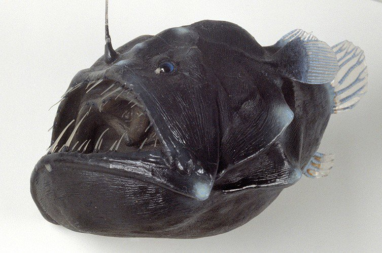

<html lang="es">
<head>
  <meta charset="UTF-8" />
  <meta name="viewport" content="width=device-width, initial-scale=1.0" />
  <title>Pez Diablo Negro</title>

  <!-- Estilos principales -->
  

  <!-- Font Awesome para íconos -->
  <link rel="stylesheet" href="https://cdnjs.cloudflare.com/ajax/libs/font-awesome/6.5.0/css/all.min.css">
</head>

<body>

  <header>
    <h1>Pez Diablo</h1>
    
Pez de las profundidades descubierto por primera vez en Tenerife

  </header>

  <nav>
    <a href="#caracteristicas">Características</a>
    <a href="#impacto">Impacto ambiental</a>
    <a href="#prevencion">Prevención</a>
    <a href="#contacto">Contacto</a>
  </nav>

  

    

      <h2> Características del Pez Diablo</h2>
      
      
El pez diablo (<em>Melanocetus johnsonii</em>)  Proviene de las profundidades marinas donde no llega la luz solar, se distingue por su aspecto intimidante al tener un cuerpo oscuro, una gran boca con afilados dientes y un apendice bioluminiscente que usa para atraer a sus presas en completa oscuridad.

    

    

      <h2> Impacto Ambiental</h2>
      
Esta especie nunca sube a la superficie y cuando lo hace suele ser porque esta muerto. Algunas teorias sugieren que pudo estar huyendo de algun depredador y fue arrastrado por las corrientes o que tal vez sufria de alguna enfermedad.

    

    

      <h2> Prevención y Control</h2>
      
Conocido tambien como "monstruo marino negro" o "rape abisal", su presencia puede indicar problemas ambientales, cambios en el habitat o en las corrientes. Para el ser humano no representa una amenaza, por otro lado algunas personas lo relacionan con presagios sobre en fin del mundo o comienzo de algo malo.

    

    

      <h2> Contacto</h2>
      
¿Quieres ayudarnos a proteger la vida marina? ¡Escríbenos!

      <a class="boton-contacto" href="#formulario">Ir al formulario</a>

      <form id="formulario">
        <h3>Formulario de contacto</h3>
        <input type="text" placeholder="Tu nombre" required>
        <input type="email" placeholder="Tu correo electrónico" required>
        <textarea placeholder="Tu mensaje" rows="5" required></textarea>
        <button type="submit">Enviar</button>
      </form>
    

    

      <h2> Refugio de Vida Marina Cercano</h2>
      
Ubicación del Parque Nacional Arrecife de Puerto Morelos (Quintana Roo, México):

      <iframe 
   src="https://www.google.com/maps/embed?pb=!1m18!1m12!1m3!1d3728.137949484888!2d-86.87152312469237!3d20.866489280742545!2m3!1f0!2f0!3f0!3m2!1i1024!2i768!4f13.1!3m3!1m2!1s0x8f4e890033ca48c5%3A0xbd58f5b1f21698f8!2sPN%20Arrecife%20de%20Puerto%20Morelos%20CONANP!5e0!3m2!1ses-419!2sar!4v1749149208800!5m2!1ses-419!2sar"
  style="width: 100%; max-width: 900px; height: 500px; border:0; display:block; margin: 0 auto;"
  allowfullscreen=""
  loading="lazy"
  referrerpolicy="no-referrer-when-downgrade">
</iframe>
    

    <!-- Redes Sociales -->
    

      <h2 style="text-align: center;"> Síguenos en redes sociales</h2>
      
Conéctate con el Parque Nacional Arrecife de Puerto Morelos:

      

        <a href="https://www.facebook.com/Parque-Nacional-Arrecife-de-Puerto-Morelos-111146335635726" 
           target="_blank" style="margin: 0 20px; color: #3b5998;">
          <i class="fab fa-facebook"></i>
        </a>
        <a href="https://www.instagram.com/explore/tags/puertomorelos/" 
           target="_blank" style="margin: 0 20px; color: #e1306c;">
          <i class="fab fa-instagram"></i>
        </a>
        <a href="https://www.youtube.com/@CONANP_mx" 
           target="_blank" style="margin: 0 20px; color: #ff0000;">
          <i class="fab fa-youtube"></i>
        </a>

  <h3 style="font-size: 16px; margin-bottom: 8px; font-weight: normal;">Rescate Fauna Marina Miramar</h3>
  

    

  

  <footer>
    
&copy; 2025 Conservación Acuática | Información educativa sobre especies invasoras

  </footer>

</body>
